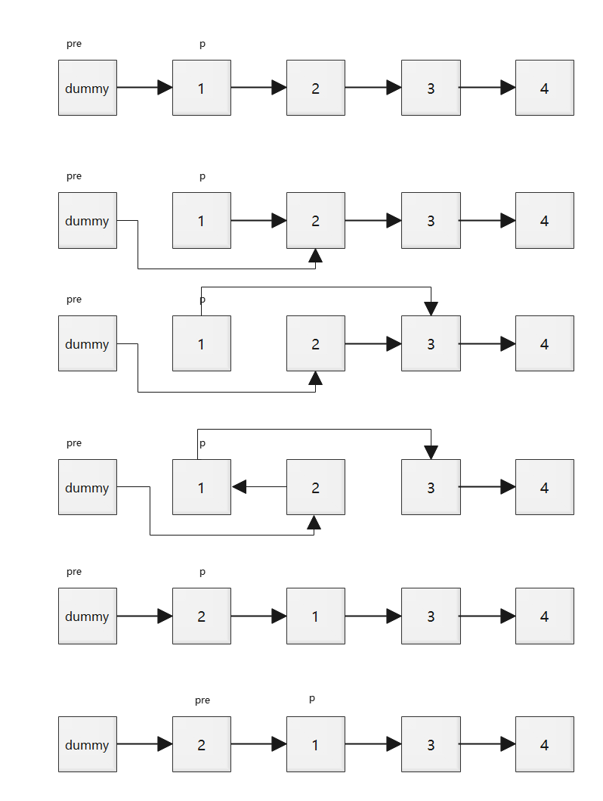
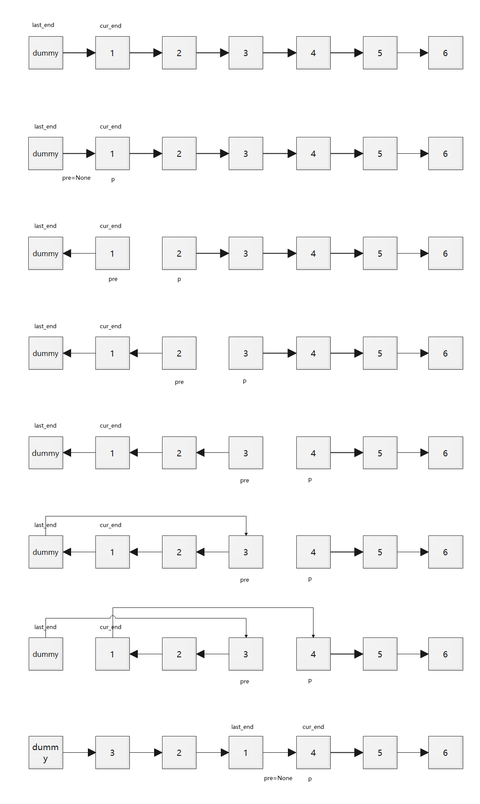

# [leetcode_cn_专题系列]01链表

[链表知识点题库 - 力扣（LeetCode） (leetcode-cn.com)](https://leetcode-cn.com/tag/linked-list/problemset/)

```python
# Definition for singly-linked list.
class ListNode:
    def __init__(self, val=0, next=None):
        self.val = val
        self.next = next
```


# leetcode


## [2. 两数相加 - 力扣（LeetCode） (leetcode-cn.com)](https://leetcode-cn.com/problems/add-two-numbers/)

### 题目描述

给你两个 非空 的链表，表示两个非负的整数。它们每位数字都是按照 逆序 的方式存储的，并且每个节点只能存储 一位 数字。

请你将两个数相加，并以相同形式返回一个表示和的链表。

你可以假设除了数字 0 之外，这两个数都不会以 0 开头。

示例 1：


```
输入：l1 = [2,4,3], l2 = [5,6,4]
输出：[7,0,8]
解释：342 + 465 = 807.
```

示例 2：

```
输入：l1 = [0], l2 = [0]
输出：[0]
```

示例3：

```
输入：l1 = [9,9,9,9,9,9,9], l2 = [9,9,9,9]
输出：[8,9,9,9,0,0,0,1]
```

### 解法1 递归

- 如果`l1.val + l2.val < 10`，不需要考虑进位，加和直接作为和链表当前节点的值，且下一个节点为`addTwoNumbers(l1.next, l2.next)`
- 如果`l1.val + l2.val >= 10`，需要考虑进位，且进位只可能为1。加和减去10作为和链表当前节点的值，且下一个节点为三个节点的值相加：构造一个值为1的`ListNode`表示进位，`l1.next`和`l2.next`，通过两次调用递归函数得到`addTwoNumbers(addTwoNumbers(l1.next, carry), l2.next)`

```python
class Solution:
    def addTwoNumbers(self, l1: ListNode, l2: ListNode) -> ListNode:
        if not l1:
            return l2
        if not l2:
            return l1
        cur_val = l1.val + l2.val
        if cur_val < 10:
            l3 = ListNode(cur_val)
            l3.next = self.addTwoNumbers(l1.next, l2.next)
        else:
            l3 = ListNode(cur_val - 10)
            carry = ListNode(1)
            l3.next = self.addTwoNumbers(self.addTwoNumbers(l1.next, carry), l2.next)
        return l3
```

### 解法2 迭代

- 定义一个进位节点carry
- `l1`, `l2`和`carry`只要有一个节点不为空，就继续迭代
- 当前节点的值为`(l1.val + l2.val + carry.val) mod 10`，如果节点为空，则值定义为0。如果`(l1.val + l2.val + carry.val) >= 10`，则进位节点的值为`(l1.val + l2.val + carry.val) // 10`，否则进位节点置为None
- 更新`l1`和`l2`

```python
class Solution:
    def addTwoNumbers(self, l1: ListNode, l2: ListNode) -> ListNode:
        dummy = ListNode(-1)
        res = dummy
        carry = None
        while l1 or l2 or carry:
            val1 = l1.val if l1 else 0
            val2 = l2.val if l2 else 0
            cval = carry.val if carry else 0
            cur_val = val1 + val2 + cval
            carry = None if cur_val < 10 else ListNode(1)
            res.next = ListNode(cur_val % 10)
            res = res.next
            l1 = l1.next if l1 else None
            l2 = l2.next if l2 else None
        return dummy.next
```


## [19. 删除链表的倒数第 N 个结点 - 力扣（LeetCode） (leetcode-cn.com)](https://leetcode-cn.com/problems/remove-nth-node-from-end-of-list/)

### 题目描述

给你一个链表，删除链表的倒数第 `n` 个结点，并且返回链表的头结点。

示例 1：


```
输入：head = [1,2,3,4,5], n = 2
输出：[1,2,3,5]
```

示例 2：

```
输入：head = [1], n = 1
输出：[]
```

示例 3：

```
输入：head = [1,2], n = 1
输出：[1]
```

### 解法1 快慢指针

- 删除倒数第n个节点，需要找到倒数第n+1个节点p，然后通过`p.next = p.next.next`就可以删掉倒数第n个节点`p.next`了。
- 寻找倒数第n+1个节点p的方法——快慢指针，以`1->2->3->4->5`，n=2为例
  - 第一步，定义一个dummy节点指向head，即`0->1->2->3->4->5`
  - 第二步，找到正数第n个节点，从0出发，向右跑n步，定义为fast节点，即2
  - 第三步，slow节点从0出发，fast节点从第n个节点(即2)出发，一起向右跑。fast节点右边还有length-n(5-2=3)个节点，那么当fast节点跑到最后一个节点5时，slow节点从0往右跑了length-n步，正数length-n个节点就是倒数第n+1个节点
  - 注意dummy节点不计入正数和倒数的索引中

```python
class Solution:
    def removeNthFromEnd(self, head: ListNode, n: int) -> ListNode:
        dummy = ListNode(0, head)
        fast = dummy
        for _ in range(n):
            fast = fast.next
        slow = dummy
        while fast.next:
            fast = fast.next
            slow = slow.next
        slow.next = slow.next.next
        return dummy.next
```


## [21. 合并两个有序链表](https://leetcode-cn.com/problems/merge-two-sorted-lists/)

### 题目描述

将两个升序链表合并为一个新的 **升序** 链表并返回。新链表是通过拼接给定的两个链表的所有节点组成的。 


示例 1：

```
输入：l1 = [1,2,4], l2 = [1,3,4]
输出：[1,1,2,3,4,4]
```

示例 2：

```
输入：l1 = [], l2 = []
输出：[]
```

示例 3：

```
输入：l1 = [], l2 = [0]
输出：[0]
```

这题和[2. 两数相加](https://leetcode-cn.com/problems/add-two-numbers/)的处理方式很相似，比较简单，直接看代码即可。

### 解法1 递归

```python
class Solution:
    def mergeTwoLists(self, l1: ListNode, l2: ListNode) -> ListNode:
        if not l1:
            return l2
        if not l2:
            return l1
        if l1.val < l2.val:
            l3 = ListNode(l1.val)
            l3.next = self.mergeTwoLists(l1.next, l2)
        else:
            l3 = ListNode(l2.val)
            l3.next = self.mergeTwoLists(l1, l2.next)
        return l3
```

### 解法2 迭代

```python
class Solution:
    def mergeTwoLists2(self, l1: ListNode, l2: ListNode) -> ListNode:
        dummy = ListNode(-1)
        res = dummy
        while l1 and l2:
            if l1.val < l2.val:
                res.next = l1
                l1 = l1.next
            else:
                res.next = l2
                l2 = l2.next
            res = res.next
        if l1:
            res.next = l1
        if l2:
            res.next = l2
        return dummy.next
```


## [23. 合并K个升序链表](https://leetcode-cn.com/problems/merge-k-sorted-lists/)

### 题目描述

给你一个链表数组，每个链表都已经按升序排列。

请你将所有链表合并到一个升序链表中，返回合并后的链表。

示例 1：

```
输入：lists = [[1,4,5],[1,3,4],[2,6]]
输出：[1,1,2,3,4,4,5,6]
解释：链表数组如下：
[
  1->4->5,
  1->3->4,
  2->6
]
将它们合并到一个有序链表中得到。
1->1->2->3->4->4->5->6
```

示例 2：

``` 
输入：lists = []
输出：[]
```

示例 3：

```
输入：lists = [[]]
输出：[]
```


提示：

```
k == lists.length
0 <= k <= 10^4
0 <= lists[i].length <= 500
-10^4 <= lists[i][j] <= 10^4
lists[i] 按 升序 排列
lists[i].length 的总和不超过 10^4
```

### 解法1 合并两个有序链表+归并排序

```python
class Solution:
    def mergeKLists(self, lists):
        def mergeTwoLists(l1, l2):
            if not l1:
                return l2
            if not l2:
                return l1
            if l1.val <= l2.val:
                l3 = ListNode(l1.val)
                l3.next = mergeTwoLists(l1.next, l2)
            else:
                l3 = ListNode(l2.val)
                l3.next = mergeTwoLists(l2.next, l1)
            return l3

        n = len(lists)
        if n == 0:
            return None
        elif n == 1:
            return lists[0]
        elif n == 2:
            return mergeTwoLists(lists[0], lists[1])
        
        mid = n // 2
        l1 = self.mergeKLists(lists[:mid])
        l2 = self.mergeKLists(lists[mid:])
        return mergeTwoLists(l1, l2)
```


### 解法2 最小堆

- 因为每个链表都是升序的，因此当前的最小值必定是所有链表head节点值中的最小值。维护一个大小为`len(lists)`的最小堆，堆中的每个元素表示一个链表当前的head节点。
- 初始化：heappush每个链表的head节点，其中节点值用于比较大小，链表索引用于找到该节点
- 迭代过程：每次得到一个当前的最小值
  - 从heap中heappop出值最小的节点，即链表`lists[index]`的head节点，作为当前节点p的下一个节点
  - 当前节点移到下一个节点，链表`lists[index]`的head节点移到下一个节点
  - 如果链表`lists[index]`head节点不为空，那么将其heappush到堆中

```python
class Solution:
    def mergeKLists(self, lists: List[ListNode]) -> ListNode:
        import heapq
        heap = []
        for i in range(len(lists)):
            if lists[i]:
                heapq.heappush(heap, (lists[i].val, i))
        
        dummy = ListNode(-1)
        p = dummy
        while heap:
            _, index = heapq.heappop(heap)
            p.next = lists[index]
            p = p.next
            lists[index] = lists[index].next
            if lists[index]:
                heapq.heappush(heap, (lists[index].val, index))
        return dummy.next
```

## [24. 两两交换链表中的节点](https://leetcode-cn.com/problems/swap-nodes-in-pairs/)

### 题目描述

给你一个链表，两两交换其中相邻的节点，并返回交换后链表的头节点。你必须在不修改节点内部的值的情况下完成本题（即，只能进行节点交换）。

示例 1：


```
输入：head = [1,2,3,4]
输出：[2,1,4,3]
```

示例 2：

```
输入：head = []
输出：[]
```

示例 3：

```
输入：head = [1]
输出：[1]
```

### 解法1 



```python
class Solution:
    def swapPairs(self, head: ListNode) -> ListNode:
        if not head or not head.next:
            return head
        dummy = ListNode(-1)
        pre, p = dummy, head
        # pre指向p的前一个节点，交换p和p.next
        while p and p.next:
            pre.next = p.next
            p.next = p.next.next
            pre.next.next = p
            pre = p
            p = p.next
        return dummy.next
```

## [25. K 个一组翻转链表](https://leetcode-cn.com/problems/reverse-nodes-in-k-group/)

### 题目描述

给你一个链表，每 k 个节点一组进行翻转，请你返回翻转后的链表。

k 是一个正整数，它的值小于或等于链表的长度。

如果节点总数不是 k 的整数倍，那么请将最后剩余的节点保持原有顺序。

进阶：

你可以设计一个只使用常数额外空间的算法来解决此问题吗？
你不能只是单纯的改变节点内部的值，而是需要实际进行节点交换。

示例 1：


```
输入：head = [1,2,3,4,5], k = 2
输出：[2,1,4,3,5]
```

示例 2：


```
输入：head = [1,2,3,4,5], k = 3
输出：[3,2,1,4,5]
```

示例 3：

```
输入：head = [1,2,3,4,5], k = 1
输出：[1,2,3,4,5]
```

示例 4：

```
输入：head = [1], k = 1
输出：[1]
```

提示：

```
列表中节点的数量在范围 sz 内
1 <= sz <= 5000
0 <= Node.val <= 1000
1 <= k <= sz
```


### 解法1

- 设置dummy节点
- 关键在于反转前先确认好 上一段的end和本段的start链接，本段的end和下一段的start链接



```python
class Solution:
    def reverseKGroup(self, head: ListNode, k: int) -> ListNode:
        if not head or not k:
            return head
        length = 0
        p = head
        while p:
            p = p.next
            length += 1
        loops = length // k
        dummy = ListNode(-1)
        dummy.next = head
        pre, p = None, head
        last_end, cur_end = dummy, head
        for _ in range(loops):
            pre = None
            for _ in range(k):
                tmp = p.next
                p.next = pre
                pre = p
                p = tmp
            # after reverse cur part, pre is cur_start, p is next_end
            # last_end.next = cur_start
            last_end.next = pre
            # cur_end.next = next_end
            cur_end.next = p
            last_end, cur_end = cur_end, p
        return dummy.next
```

## [61. 旋转链表](https://leetcode-cn.com/problems/rotate-list/)

### 题目描述

给你一个链表的头节点 head ，旋转链表，将链表每个节点向右移动 k 个位置。

示例 1：


```
输入：head = [1,2,3,4,5], k = 2
输出：[4,5,1,2,3]
```

示例 2：


```
输入：head = [0,1,2], k = 4
输出：[2,0,1]
```


提示：

```
链表中节点的数目在范围 [0, 500] 内
-100 <= Node.val <= 100
0 <= k <= 2 * 109
```

### 解法1


# 剑指offer


# 面试题

